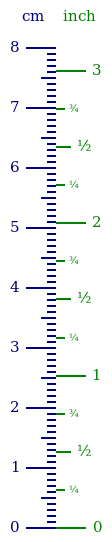

# Axes

## Quicklinks

[`cv_format_ticks`](./Axis.md#user-content-cv_format_ticks)   [`CV_TickLabelAppearance`](./Axis.md#user-content-cv_ticklabelappearance)   [`CV_Ruler`](./Axis.md#user-content-cv_ruler)   [`cv_ticks_labels`](./Axis.md#user-content-cv_ticks_labels)

## Names

Let's start with some vocabulary

  *  tick: A marker for a mathematical coordinate
  *  tick label: A text below a tick (may be the empty string, i.e. no text)
  *  ruler: several ticks (with optional tick labels) and information about styling
  *  axis: several rulers

## Tick labels

### `CV_TickLabel`

```
struct CV_TickLabel{LocT}
    location    :: LocT
    text        :: AbstractString
end
```

A location (math coordinate) and a description for a tick (typically placed at axis).

### `cv_format_ticks`

```
cv_format_ticks(printf_format, locations)

printf_format   AbstractString     used for @sprintf
locations       Vararg{Real, N}
```

create for every location a [`CV_TickLabel`](./Axis.md#user-content-cv_ticklabel) by formatting the locations with the given printf-format.

```
cv_format_ticks(locations)

locations   Vararg{Real, N}
```

create for every location a [`CV_TickLabel`](./Axis.md#user-content-cv_ticklabel) by formatting the locations with the `"%.1f"` printf-format.

### `CV_TickLabelAppearance`

Styles and data needed to render/draw axis-ticks with labels.

```
CV_TickLabelAppearance(; tick_length, gap, tick_style, label_style)

tick_length   Integer          Int32(10)
gap           Integer          cv_half(tick_length)
tick_style    CV_ContextStyle  cv_linewidth(2) → cv_black
label_style   CV_ContextStyle  cv_black → cv_fontface("serif") → cv_fontsize(15)
```

```
CV_TickLabelAppearance(old; tick_length, gap, tick_style, label_style)

old           CV_TickLabelAppearance
tick_length   Integer                 old.tick_length
gap           Integer                 old.gap
tick_style    CV_ContextStyle         old.tick_style
label_style   CV_ContextStyle         old.label_style
```

### `CV_Ruler`

Ticks with their labels and appearance.

```
CV_Ruler(ticklabels[, app])

ticklabels  NTuple{N, CV_TickLabel{LocT}}
app         CV_TickLabelAppearance{tsT, lsT}
```

```
CV_Ruler(ticklabels)

ticklabels   Vararg{CV_TickLabel{LocT}, N}
```

### `cv_create_2daxis_canvas`

```
cv_create_2daxis_canvas(for_canvas, attach, rulers)

for_canvas   CV_Math2DCanvas
attach       Union{cv_north, cv_south, cv_east, cv_west}
rulers       Tuple{Vararg{CV_Ruler, N}}
```

create a `CV_2DLayoutCanvas` to render the given rulers. Position the ticks and labels such that the axis-canvas can be attached to `for_canvas` at the given `attach` position.

```
cv_create_2daxis_canvas(for_canvas, attach, ticklabels; app)

for_canvas   CV_Math2DCanvas
attach       Union{cv_north, cv_south, cv_east, cv_west}
ticklabels   Vararg{CV_TickLabel{Float64}, N}
app          CV_TickLabelAppearance
```

### `cv_ticks_labels`

```
cv_ticks_labels(layout, for_canvas_l, attach, rulers)

layout         CV_Abstract2DLayout
for_canvas_l   CV_2DLayoutPosition
attach         Union{cv_north, cv_south, cv_east, cv_west}
rulers         Tuple{Vararg{ComplexVisual.CV_Ruler, N}}
```

short version for [`cv_create_2daxis_canvas`](./Axis.md#user-content-cv_create_2daxis_canvas) and `cv_add_canvas!`.

```
cv_ticks_labels(layout, for_canvas_l, attach, ticklabels; app)

layout         CV_Abstract2DLayout
for_canvas_l   CV_2DLayoutPosition
attach         Union{cv_north, cv_south, cv_east, cv_west}
ticklabels     Vararg{CV_TickLabel{Float64}, N}
```

## Advanced Example

Here is an example showing the construction of rulers.



```julia
function example_inches_cm()
    layout = CV_2DLayout()
    math_canvas = CV_Math2DCanvas(0.0 +0.0im, 1.0 - 8.0im, 60)

    in_unit = 2.54
    col_cm, col_in = cv_color(0, 0, 0.5), cv_color(0, 0.5, 0)
    font_large = cv_fontface("serif") → cv_fontsize(15)
    font_small = cv_fontface("serif") → cv_fontsize(10)

    app1(col) = CV_TickLabelAppearance(; tick_length=30, gap=7,
        tick_style=col → cv_linewidth(2), label_style=col → font_large)
    app2(col) = CV_TickLabelAppearance(; tick_length=15,
        tick_style=col → cv_linewidth(2), label_style=col → font_large)
    app3(col) = CV_TickLabelAppearance(; tick_length=9,
        tick_style=col → cv_linewidth(2), label_style=col → font_small)
    app4(col) = CV_TickLabelAppearance(; tick_length=0, gap=5,
        tick_style=col → cv_linewidth(2), label_style=col → font_large)

    loc1 = 0.0:1.0:8.0;  ticks1 = cv_format_ticks("%0.f", loc1...)
    loc2 = 0.5:1.0:7.5;  ticks2 = cv_format_ticks("", loc2...)
    loc3 = setdiff(setdiff(0.0:0.1:8.0, loc1), loc2)

    ticks3 = cv_format_ticks("", loc3...)

    rulers1 = (
        CV_Ruler(ticks1, app1(col_cm)), CV_Ruler(ticks2, app2(col_cm)),
        CV_Ruler(ticks3, app3(col_cm)),)
    axis1_canvas = cv_create_2daxis_canvas(math_canvas, cv_west, rulers1)

    loc1 = 0.0:1.0:3.0
    ticks1 = tuple(
        map( v -> CV_TickLabel(v*in_unit, @sprintf("%0.f", v)), loc1)...)
    loc2 = setdiff(0.0:0.5:2.5, loc1)
    ticks2 = tuple(map(v -> CV_TickLabel(v*in_unit, "½"), loc2)...)
    loc3 = setdiff(setdiff(0.0:0.25:3.0, loc1), loc2)
    ticks3 = tuple(map(e -> CV_TickLabel(e[2]*in_unit,
            isodd(e[1]) ? "¼" : "¾"), enumerate(loc3))...)

    rulers2 = (
        CV_Ruler(ticks1, app1(col_in)), CV_Ruler(ticks2, app2(col_in)),
        CV_Ruler(ticks3, app3(col_in)),)
    axis2_canvas = cv_create_2daxis_canvas(math_canvas, cv_east, rulers2)

    axis1_canvas_l = cv_add_canvas!(layout, axis1_canvas,
        cv_anchor(axis1_canvas, :default), (0,0))
    axis2_canvas_l = cv_add_canvas!(layout, axis2_canvas,
        cv_anchor(axis2_canvas, :default), (0,0))

    cm_text = cv_text("cm", col_cm → font_large)
    cm_l = cv_add_canvas!(layout, cm_text,
        cv_anchor(cm_text, :baseline_center),
        cv_translate(cv_anchor(axis1_canvas_l, :north), 0, -20))

    in_text = cv_text("inch", col_in → font_large)
    in_l = cv_add_canvas!(layout, in_text,
        cv_anchor(in_text, :baseline_center),
        cv_translate(
            cv_anchor(axis2_canvas_l, :north, axis1_canvas_l, :north), 0, -20))

    cv_add_padding!(layout, 10)

    can_layout = cv_canvas_for_layout(layout)
    cv_create_context(can_layout) do con_layout
        axis1_canvas_l(con_layout); axis2_canvas_l(con_layout)
        cm_l(con_layout); in_l(con_layout)
    end

    return can_layout
end
```


