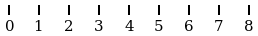
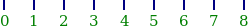
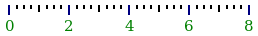

# Axes

## Names

Let's start with some vocabulary

  *  tick: A marker for a mathematical coordinate
  *  tick label: A text below a tick (may be the empty string, i.e. no text)
  *  ruler: several ticks (with optional tick labels) and information about styling
  *  axis: several rulers

## Tick labels

### `CV_TickLabel`

```
struct CV_TickLabel{LocT}
    location    :: LocT
    text        :: AbstractString
end
```

A location (math coordinate) and a description for a tick (typically placed at axis).

### `cv_format_ticks`

```
cv_format_ticks(printf_format, locations)

printf_format   AbstractString     used for @sprintf
locations       Vararg{Real, N}
```

create for every location a [`CV_TickLabel`](./Axis.md#user-content-cv_ticklabel) by formatting the locations with the given printf-format.

```
cv_format_ticks(locations)

locations   Vararg{Real, N}
```

create for every location a [`CV_TickLabel`](./Axis.md#user-content-cv_ticklabel) by formatting the locations with the `"%.1f"` printf-format.


