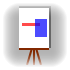

# [ Canvas](./Canvas.md)

Canvases (i.e. subtypes of [`CV_Canvas`](./Canvas.md#user-content-cv_canvas)) are thin wrappers for Cairo canvases.

## `CV_Canvas`

[`CV_Canvas`](./Canvas.md#user-content-cv_canvas): something where you can draw and paint.

## `CV_2DCanvas`

```
CV_2DCanvas <: CV_Canvas
    # required fields:
    # surface       (CairoSurface)
    # pixel_width   (convert(Int32, surface.width))
    # pixel_height  (convert(Int32, surface.height))
    # bounding_box  (CV_Rectangle{Int32})  bottom=0, left=0 (i.e. zero-based)
```

a thin wrapper around a `CairoSurface` (where `pixel_width` and `pixel_height` are `Int32`, instead of `Floats`) for twodimensional painting and drawing operations.

There are canvases with "only" pixel coorindates (like [`CV_Std2DCanvas`](./Canvas.md#user-content-cv_std2dcanvas)) and there are canvases which also have a mathematical coordinate system (like [`CV_Math2DCanvas`](./Canvas.md#user-content-cv_math2dcanvas)).

## `CV_Std2DCanvas`

```
CV_Std2DCanvas <: CV_2DCanvas 
    surface          Cairo.CairoSurfaceImage{UInt32}
    pixel_width      Int32
    pixel_height     Int32
    bounding_box     CV_Rectangle{Int32}
```

A twodimensional canvas with a `CairoSurfaceImage` (ARGB32 format).

## `CV_Math2DCanvas`

```
CV_Math2DCanvas <: CV_2DCanvas
    corner_ul       Complex{Float64}  # (math.) coordinates of upper left corner
    corner_lr       Complex{Float64}  # (math.) coordinates of lower right corner
    resolution      Float64           # Pixels per (math.) unit
    surface         Cairo.CairoSurfaceImage{UInt32}
    pixel_width     Int32
    pixel_height    Int32
    bounding_box    CV_Rectangle{Int32}
```

A twodimensional canvas with a `CairoSurfaceImage` (ARGB32 format) where the user coordinates represent a mathmatical coordinate system. With the two methods [`cv_math2pixel`](./Canvas.md#user-content-cv_math2pixel) and [`cv_pixel2math`](./Canvas.md#user-content-cv_pixel2math) one can transform math coordinates to pixel coordinates and vice versa. See also: [`CV_MathCoorStyle`](./Style.md#user-content-cv_mathcoorstyle).

## `cv_math2pixel`

```
cv_math2pixel(canvas, mx, my) :: Tuple{Int32, Int32}
    canvas      CV_Math2DCanvas
    mx          Float64
    my          Float64
```

convert math coordinates `(mx, my)` to pixel coordinates.

## `cv_pixel2math`

```
cv_pixel2math(canvas, px, py::Integer) :: Tuple{Float64, Float64}
    canvas    CV_Math2DCanvas
    px        Integer
    pyi       Integer
```

convert pixel coordinates `(px, py)` to math coordinates.

## `cv_save_image`

```
cv_save_image(canvas, filename)
    canvas      CV_2DCanvas
    filename    AbstractString
```

save content of canvas as a png image.


