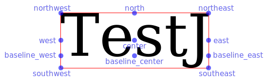

# Layout (Positioning of graphic objects)

In order to visualize functions, phase portraits, etc. we have to place graphical objects for the visualization. We call this: "to layout".

To make things simple we only use "fixed" layouts, i.e. after the objects are positioned they cannot change size and/or position.

The layout process always uses rectangular regions. Because graphic objects may be (partially) transparent (or half-transparent, etc.) the underlying rectangles are not always visible.

At the end of the layout process (after every object has its position and size) one typically creates a "canvas" where all the objects are drawn/shown.

## Coordinate system

All the layout process uses the [pixel coordinate system](./PixelCoordinates.md).


## "Hello-world" example

Let's start with a hello-world example.

```julia
function hello_world_example()
    layout = CV_2DLayout()

    first_object = cv_filled_canvas(100, 50, cv_color(1, 0, 0))
    first_object_location = cv_add_canvas!(layout, first_object,
        cv_anchor(first_object, :northwest), (0, 0))

    can_layout = cv_canvas_for_layout(layout)
    cv_create_context(can_layout) do con_layout
        first_object_location(con_layout)
    end

    return can_layout
end
```

### creating a graphic object

As a simple graphic object we use `cv_filled_canvas` to construct a canvas with width of 100 pixels and height of 50 pixels which is totally filled with red.

### position the object (with absolute coordinates)

Then this canvas is positioned with `cv_add_canvas!`. This method needs to know where to place the object (here in the example the location is `(0,0)`) and what part/anchor of the object should be at this position. In this example the north-west corner of the rectangle (of the filled cavnas) should be at position `(0,0)`.

see `cv_anchor` 

### layout positions

The return value of `cv_add_canvas!` (and other `cv_add_...` methods) are "layout positions". In this example `first_object_location` is:

```
CV_2DLayoutPosition(
  rectangle: CV_Rectangle(▬0→100, 0↑50▬)
  canvas: CV_Std2DCanvas(
    surface: Ptr{Nothing} @0x0000000003671900
    pixel_width: 100
    pixel_height: 50
    bounding_box: CV_Rectangle(▬0→100, 0↑50▬)
  )
  drawing_cb: nothing
  style: CV_ContextOperatorStyle(opmode: 2)
)
```

All these layout positions are callable (they are callable structs). What happens if they are called is explained in the next section.

### creating a layout canvas and drawing the content

With `cv_canvas_for_layout` the smallest bounding box of all positioned objects (in the example there is only the `first_object`) is used to contruct a canvas of this size of the bounding box.

With `cv_create_context` a drawing context `con_layout` is constructed and alle the layout position.

Now all layout positions can be called with such a context to draw/show their visualization inside the layout canvas.

The output of this example is very boring:


## More advanced example

One can use the `cv_anchor` method on layout positions to place the next objects. This is much more convenient than computing the absolute coordinates for the positions.

There is also a `cv_translate` method to modifiy (anchor-)position (tuples) by translating them.

Here this methods can be seen in action:

```julia
function more_advanced_example()
    layout = CV_2DLayout()

    red_canvas = cv_filled_canvas(200, 200, cv_color(1, 0, 0))
    red_canvas_l = cv_add_canvas!(layout, red_canvas,
        cv_anchor(red_canvas, :center), (0, 0))

    green_canvas = cv_filled_canvas(50, 50, cv_color(0, 1, 0, 0.8))
    green_canvas_l = cv_add_canvas!(layout, green_canvas,
        cv_anchor(green_canvas, :center), cv_anchor(red_canvas_l, :east))

    blue_canvas = cv_filled_canvas(cv_width(red_canvas_l), 10, cv_color(0, 0, 1))
    blue_canvas_l = cv_add_canvas!(layout, blue_canvas,
        cv_anchor(blue_canvas, :south), 
        cv_translate(cv_anchor(red_canvas_l, :north), 0, -10))

    can_layout = cv_canvas_for_layout(layout)
    cv_create_context(can_layout) do con_layout
        red_canvas_l(con_layout)
        green_canvas_l(con_layout)
        blue_canvas_l(con_layout)
    end

    return can_layout
end
```

and thats the result:


## Other anchors (e.g. with axis)

There are canvases that define further anchors (in addition to the anchors that are possible for rectangles). Typically example are axes.

The ticks of an axis need to be aligned with a mathematical coordinate system (it's the main task of an axis to exactly show such coordinate positions). But because of the labels/text below the ticks the axis canvas north-west corner ist typically not the place where the first tick of an horitzonal axis starts.

Let's look at the following example.

```julia
function other_anchors_axis()
    layout = CV_2DLayout()

    math_canvas = CV_Math2DCanvas(0.0 +1.0im, 1.0 + 0.0im, 180)
    math_canvas_l = cv_add_canvas!(layout, math_canvas,
        cv_anchor(math_canvas, :center), (0, 0))
    cv_create_context(math_canvas) do con_math # just to fill it blue
        cv_paint(con_math, cv_color(0,0,1) ↦ CV_2DCanvasFillPainter(),
            CV_EmptyPaintingContext())
    end

    rulers = (CV_Ruler(CV_TickLabel(0.0, "left"),
            CV_TickLabel(0.5, "center"), CV_TickLabel(1.0, "right")),)

    south_axis_canvas = cv_create_2daxis_canvas(math_canvas, cv_south, rulers)
    south_axis_canvas_l = cv_add_canvas!(layout, south_axis_canvas,
        cv_anchor(south_axis_canvas, :default),
        cv_anchor(math_canvas_l, :southwest))

    show_axis_bg_l = cv_add_rectangle!(layout, south_axis_canvas_l.rectangle,
        cv_fill_rectangle_cb, cv_color(0.7, 0.7, 0.7)) # fill axis bg with gray

    north_axis_l = cv_ticks_labels(layout, math_canvas_l, cv_north, rulers)

    cv_add_padding!(layout, 10)

    can_layout = cv_canvas_for_layout(layout)
    cv_create_context(can_layout) do con_layout
        math_canvas_l(con_layout)
        show_axis_bg_l(con_layout)
        south_axis_canvas_l(con_layout)
        north_axis_l(con_layout)
    end

    return can_layout
end
```

which generates the following layout:


Here a `CV_Math2DCanvas` is used to have an canvas with a mathematical coordinate system (inside) [in order to make this canvas visibile it is filled with blue].

The background of the axis at the south is filled (on purpose) with gray to see that the north-west corner of this axis is not the place where the first axis tick is located (that's because the tick label "left" below the first tick needs to be rendered and needs some horizontal space to the left). Every axis has an anchor with `:default` which is the location/position of the first tick. That's why put the position `:default` of the axis at the south-west corner of the math canvas.

Typically this can be done more conveniently with the function `cv_ticks_labels`. The axis at the north was constructed with this function in one line.


## Other anchors (e.g. with text)

A text canvas is another case where additonal anchors are useful. With `cv_text(text_to_show, style)` a canvas with text can be constructed.

For the text canvas

```julia
    ctext = cv_text("TestJ",
        cv_black → cv_op_over → cv_fontface("serif") → cv_fontsize(120))
```

some available anchors are shown in this picture:




## Graphic "objects" that are not canvases

Until now all the objects that were added to layouts were canvases. There is an additional possibility to show/visulize something in a layout: a rectangle (region) with a "drawing callback".

With `cv_add_rectangle!` it is possible to a add rectangle region to the layout and also give a `drawing_cb` function of the form

```julia
    drawing_cb(context::CV_2DCanvasContext, layout_pos::CV_2DLayoutPosition)
```

This "drawing callback" will be called every time the layout position is called.

Typically this method is used for drawing (rectangular) borders via `cv_border` (which calls `cv_add_rectangle!`) or directly calling `cv_add_rectangle!` and using as `drawing_cb` e.g. `cv_fill_circle_cb`.

Here ist an exmaple:

```julia
function graphic_callbacks()
    layout = CV_2DLayout()

    red_canvas = cv_filled_canvas(200, 200, cv_color(1, 0, 0))
    red_canvas_l = cv_add_canvas!(layout, red_canvas,
        cv_anchor(red_canvas, :center), (0, 0))

    ball_size = 50

    border1_l = cv_border(layout, red_canvas_l; style=cv_black)
    border2_l = cv_border(layout, border1_l; style=cv_color(0,0,1), gap_north=3)
    border3_l = cv_border(layout, border2_l; style=cv_color(0,1,0),
        gap_north=ball_size, gap_east=3, gap_south=3)

    ball_l = cv_add_rectangle!(layout, ball_size, ball_size,
        (ball_size ÷ 2, ball_size), cv_anchor(border2_l, :north),
        cv_fill_circle_cb, cv_color(0.8, 0.8, 0.8))

    cv_add_padding!(layout, 10)

    can_layout = cv_canvas_for_layout(layout)
    cv_create_context(can_layout) do con_layout
        red_canvas_l(con_layout)
        border1_l(con_layout)
        border2_l(con_layout)
        border3_l(con_layout)
        ball_l(con_layout)
    end

    return can_layout
end
```

and its output:


