# [ Painter](./Painter.md)

Painters have the ability to "draw"/"paint" something inside objects with math coordinate systems (e.g. `CV_Math2DCanvas`).

Typically a `CV_ContextStyle` is "attached" to a painter (via [`↦`](./Painter.md#user-content--u21a6) or [`CV_StyledPainter`](./Painter.md#user-content-cv_styledpainter)) to govern the appearance (color, font, line width, etc.) of the painting operations.

## Quick links

| "area" painters                                                                                                                                          | curve  painters                                                                                                                        | other painters                                                                                                                           |
|:-------------------------------------------------------------------------------------------------------------------------------------------------------- |:-------------------------------------------------------------------------------------------------------------------------------------- |:---------------------------------------------------------------------------------------------------------------------------------------- |
|  [`CV_FillPainter`](./Painter.md#user-content-cv_fillpainter)                           | 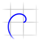 [`CV_LinePainter`](./Painter.md#user-content-cv_linepainter)         |  [`CV_ValueMarkPainter`](./Painter.md#user-content-cv_valuemarkpainter) |
|  [`CV_PortraitPainter`](./Painter.md#user-content-cv_portraitpainter)           |  [`CV_DirectionPainter`](./Painter.md#user-content-cv_directionpainter) | 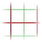 [`CV_GridPainter`](./Painter.md#user-content-cv_gridpainter)           |
|  [`CV_Math2DCanvasPainter`](./Painter.md#user-content-cv_math2dcanvaspainter) |                                                                                                                                        | [`CV_CombiPainter`](./Painter.md#user-content-cv_combipainter)   [`→`](./Painter.md#user-content--u2192)                                 |
|  [`CV_WindingPainter`](./Painter.md#user-content-cv_windingpainter)               |                                                                                                                                        | [`CV_StyledPainter`](./Painter.md#user-content-cv_styledpainter), [`↦`](./Painter.md#user-content--u21a6)                                |

construction of line segments: [`cv_parallel_lines`](./Painter.md#user-content-cv_parallel_lines)  [`cv_arc_lines`](./Painter.md#user-content-cv_arc_lines)  [`cv_star_lines`](./Painter.md#user-content-cv_star_lines)

## The `trafo` (or `dst_trafo`) argument

Many painters support a `trafo` argument (which is sometimes called `dst_trafo` when other transformations are involved) in order to "transform" the objects before painting them. Such a transformation has always the form

```julia
    trafo(z::ComplexF64) :: ComplexF64
```

If this `trafo` depends on other parameters then this can be used to change the output of the painters by chaning the parameters (of the `trafo`).

Here is an example.

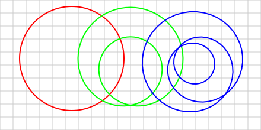

```julia
function example_trafo()
    math_canvas = CV_Math2DCanvas(-1.0 + 1.0im, 3.0 - 1.0im, 110)

    bg_fill = cv_white ↦ CV_FillPainter()  # for background
    grid_style = cv_color(0.8, 0.8, 0.8) → cv_linewidth(1)
    grid = grid_style ↦ CV_GridPainter(-1.0:0.2:3.0, -1.0:0.2:1.0)

    n = 0
    trafo = z -> z^n + n - 1 

    lp = CV_LinePainter(trafo, [cv_arc_lines(0, 2π, (0.8,))[1] .+ 0.1 .+ 0.1im])
    style1 = cv_color(1,0,0) → cv_linewidth(2)
    style2 = cv_color(0,1,0) → cv_linewidth(2)
    style3 = cv_color(0,0,1) → cv_linewidth(2)

    cv_create_context(math_canvas) do canvas_context
        cv_paint(canvas_context, bg_fill)
        cv_paint(canvas_context, grid)

        n = 1; cv_paint(canvas_context, style1 ↦ lp)
        n = 2; cv_paint(canvas_context, style2 ↦ lp)
        n = 3; cv_paint(canvas_context, style3 ↦ lp)
    end

    return math_canvas
end
```

## `CV_FillPainter`

```
CV_FillPainter <: CV_2DCanvasPainter
    no fields
```

A painter filling the complete canvas.

A `CV_ContextStyle` is typically used to govern the appearance of the filling operation.

## Example for `CV_FillPainter`


```julia
function example_fill_painter()
    math_canvas = CV_Math2DCanvas(0.0 + 1.0im, 1.0 + 0.0im, 220)

    fill_painter = CV_FillPainter()
    styled_painter = cv_color(0.7, 0.4, 0.4) ↦ fill_painter
    
    cv_create_context(math_canvas) do canvas_context
        cv_paint(canvas_context, styled_painter)
    end

    return math_canvas
end
```

## `CV_ValueMarkPainter`

```
CV_ValueMarkPainter{N<:Number}
    where     CV_TranslateByOffset{N}
    start     Float64
    len       Float64
    vertical  Bool
```

A painter drawing a vertical line-segment `(where, start)` to `(where, start + len)` (in the math coordinate system). Here the `where` is the where-value of a `CV_TranslateByOffset`. If `vertical` is `true` then the real- and imag-coordinates are swapped for drawing.

This painter is typically used for Sliders to mark the current slider position.

## Example for `CV_ValueMarkPainter`

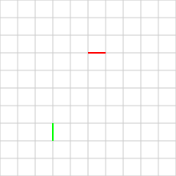

```julia
function example_mark_painter()
    math_canvas = CV_Math2DCanvas(0.0 + 1.0im, 1.0 + 0.0im, 220)

    x_pos, y_pos = CV_TranslateByOffset(Float64), CV_TranslateByOffset(Float64)
    x_pos.value, y_pos.value = 0.7, 0.3

    bg_fill = cv_white ↦ CV_FillPainter()  # for background
    grid_style = cv_color(0.8, 0.8, 0.8) → cv_linewidth(1)
    grid = grid_style ↦ CV_GridPainter(0.0:0.1:1.0, 0.0:0.1:1.0)
    horiz_mark = CV_ValueMarkPainter(x_pos, 0.5, 0.1, true)
    vert_mark = CV_ValueMarkPainter(y_pos, 0.2, 0.1, false)

    h_painter = (cv_color(1,0,0) → cv_linewidth(2)) ↦ horiz_mark
    v_painter = (cv_color(0,1,0) → cv_linewidth(2)) ↦ vert_mark

    cv_create_context(math_canvas) do canvas_context
        cv_paint(canvas_context, bg_fill)
        cv_paint(canvas_context, grid)
        cv_paint(canvas_context, h_painter)
        cv_paint(canvas_context, v_painter)
    end

    return math_canvas
end
```

## `CV_GridPainter`

```
CV_GridPainter <: CV_2DCanvasPainter
    reals   Vector{Float64}
    imags   Vector{Float64}
```

A painter for drawing horizontal and vertical grid lines.

`CV_GridPainter(reals, imags)`

```
reals    Union{NTuple{N, Real}, AbstractVector{Float64}}
imags    Union{NTuple{M, Real}, AbstractVector{Float64}}
```

construct grid for given real- and imag-values.

## Example for `CV_GridPainter`

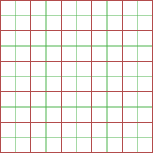

```julia
function example_grid_painter()
    math_canvas = CV_Math2DCanvas(0.0 + 1.0im, 1.0 + 0.0im, 220)

    bg_fill = cv_white ↦ CV_FillPainter()  # for background

    style1 = cv_color(0.7, 0.3, 0.3) → cv_linewidth(2)
    grid1 = style1 ↦ CV_GridPainter(0.0:0.2:1.0, 0.0:0.2:1.0)

    style2 = cv_color(0.3, 0.7, 0.3) → cv_linewidth(1)
    grid2 = style2 ↦ CV_GridPainter(0.1:0.2:0.9, 0.1:0.2:0.9)

    cv_create_context(math_canvas) do canvas_context
        cv_paint(canvas_context, bg_fill)
        cv_paint(canvas_context, grid2)
        cv_paint(canvas_context, grid1)
    end

    return math_canvas
end
```

## `CV_LinePainter`

```
CV_LinePainter{dtrafoT, strafoT, scutT} <: CV_2DCanvasPainter
    dst_trafo           dtrafoT
    segments            CV_LineSegments
    auto_close_path     Bool
    src_trafo           strafoT
    src_cut_test        scutT
```

Painting `CV_LineSegments` as curves.

All the points of the line segments are transformed according to `dst_trafo`.

The preimage of the line segments are transformed by `src_trafo` (unless `src_trafo === nothing`) and afterwards they are checked with `src_cut_test` (unless `src_cut_test === nothing`) if the line-segment needs to be "cut" (i.e. the line is interrupted there).

```
CV_LinePainter(dst_trafo, segments, auto_close_path=false)
    dst_trafo
    segments           CV_LineSegments
    auto_close_path    Bool
```

with `src_trafo` and `src_cut_test` both `nothing`.

```
CV_LinePainter(segments, auto_close_path=false)
    segments           CV_LineSegments
    auto_close_path    Bool
```

`dst_trafo = identity` and with `src_trafo` and `src_cut_test` both `nothing`.

## Example for `CV_LinePainter`

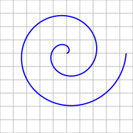

```julia
function example_line_painter()
    math_canvas = CV_Math2DCanvas(-1.0 + 1.0im, 1.0 + -1.0im, 110)
    bg_fill = cv_white ↦ CV_FillPainter()  # for background

    grid_style = cv_color(0.7, 0.7, 0.7) → cv_linewidth(1)
    grid = grid_style ↦ CV_GridPainter(-1.0:0.2:1.0, -1.0:0.2:1.0)

    segment = [0.2im + exp(ϕ*2im)*ϕ/7 for ϕ in LinRange(0, 2*π, 200)]
    style = cv_color(0, 0, 1) → cv_linewidth(2)

    seg_painter = style ↦ CV_LinePainter([segment])

    cv_create_context(math_canvas) do canvas_context
        cv_paint(canvas_context, bg_fill)
        cv_paint(canvas_context, grid)
        cv_paint(canvas_context, seg_painter)
    end

    return math_canvas
end
```

## `CV_DirectionPainter`

```
CV_DirectionPainter{trafoT} <: CV_2DCanvasPainter
    trafo              trafoT
    segments           CV_LineSegments
    auto_close_path    Bool
    every_len          Float64
    pre_gap            Float64
    arrow              ComplexF64
```

Paint triangles (along a curve) to indicate the direction of a curve.

```
CV_DirectionPainter(trafo, segments, auto_close_path=false; 
        every_len=2.0, pre_gap=0.0, arrow=0.3*exp(1im*π*8/9)) 
    trafo   
    segments          CV_LineSegments
    auto_close_path   Bool
    every_len         Real
    pre_gap           Real
    arrow             ComplexF64
```

The `arrow` parameter describes the shape of the triangle:

```
      arrow
        *   ^
        |\  │
        |░\ │
        |░░\│
    ────|░░░┼────>
        |░░/│
        |░/ │
        |/  │
        *   │
     conj(arrow)
```

Moves along the curve. Places after `every_len` a arrow/triangle showing in the direction of the curve. `pre_gap` can be used to prohibit a triangle at the beginning (with length `pre_gap`).

## Example for `CV_DirectionPainter`

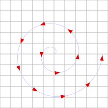

```julia
function example_dir_painter()
    math_canvas = CV_Math2DCanvas(-1.0 + 1.0im, 1.0 + -1.0im, 110)
    bg_fill = cv_white ↦ CV_FillPainter()  # for background

    grid_style = cv_color(0.7, 0.7, 0.7) → cv_linewidth(1)
    grid = grid_style ↦ CV_GridPainter(-1.0:0.2:1.0, -1.0:0.2:1.0)

    segment = [0.2im + exp(ϕ*2im)*ϕ/7 for ϕ in LinRange(0, 2*π, 200)]
    style = cv_color(0.8, 0.8, 1) → cv_linewidth(1)  # light blue for curve
    seg_painter = style ↦ CV_LinePainter([segment])

    dir_style = cv_color(0.9, 0, 0)
    dir_painter = dir_style ↦ CV_DirectionPainter(identity,
        [segment]; every_len=0.5, arrow=0.1*exp(1im*π*8/9))

    cv_create_context(math_canvas) do canvas_context
        cv_paint(canvas_context, bg_fill)
        cv_paint(canvas_context, grid)
        cv_paint(canvas_context, seg_painter)
        cv_paint(canvas_context, dir_painter)
    end

    return math_canvas
end
```

## `CV_PortraitPainter`

```
CV_PortraitPainter{CS}
    trafo           trafoT
    colorscheme     CS
    cache_flag      Bool
    cache           CV_Math2DCanvasPainterCache    
```

Fill math coordinate system with phase portrait.

For `colorscheme`, please see the package `ComplexPortraits`.

```
CV_PortraitPainter([trafo=identity, [colorscheme=ComplexPortraits.cs_j(),
                                    [cache_flag=true]]])
    trafo         trafoT
    colorscheme   CS
    cache_flag    Bool
```

## Example for `CV_PortraitPainter`

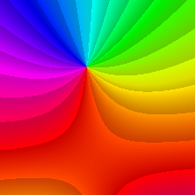

```julia
function example_portrait_painter()
    math_canvas = CV_Math2DCanvas(0.0 + 1.0im, 1.0 + 0.0im, 220)

    trafo = z -> (z - 0.6 - 0.2im)^2 + 0.15*exp(z)
    painter = CV_PortraitPainter(trafo)

    cv_create_context(math_canvas) do canvas_context
        cv_paint(canvas_context, painter)
    end

    return math_canvas
end
```

## `CV_CombiPainter`

```
CV_CombiPainter{T<:CV_Painter, S<:CV_Painter}
    painter1   T
    painter2   S
```

combines two painters.

## `→ (U+2192)`

`→(painter1, painter2)  = CV_CombiPainter(painter1, painter2)`

## `CV_StyledPainter`

```
CV_StyledPainter{styleT<:CV_ContextStyle, painterT<:CV_Painter}
    style       styleT
    painter     painterT
```

Painter with Style :-)

This is *the* way to govern the appearance (color, thickness, etc.) of the painting operations of a painter.

## `↦ (U+21A6)`

`↦(style, painter) = CV_StyledPainter(style, painter)`

## `CV_Math2DCanvasPainter`

```
CV_Math2DCanvasPainter <: CV_2DCanvasPainter
    dst_trafo       dtrafoT
    canvas          canvasT <: CV_Math2DCanvas
    src_trafo       strafoT
    src_cut_test    scutT
```

paint transformed (by `dst_trafo`) canvas in coordinate system.

The preimage of the pixel (of the canvas) are transformed by `src_trafo` (unless `src_trafo === nothing`) and afterwards they are checked with `src_cut_test` (unless `src_cut_test === nothing`) if the pixels needs to be "cut" (i.e. left out).

## Example for `CV_Math2DCanvasPainter`


```julia
function example_m2d_canvas_painter()
    math_canvas = CV_Math2DCanvas(0.0 + 1.0im, 1.0 + 0.0im, 220)

    bg_fill = cv_white ↦ CV_FillPainter()
    grid_style = cv_color(0.8, 0.8, 0.8) → cv_linewidth(1)
    grid = grid_style ↦ CV_GridPainter(0.0:0.1:1.0, 0.0:0.1:1.0)

    can_letter = cv_example_image_letter(; letter="E",
        canvas=CV_Math2DCanvas(-0.5 + 0.5im, 0.5 -0.5im, 400))

    trafo = z -> (0.8*z - 0.6 - 0.2im)^2 + 0.10*exp(0.8*z) + 0.2im
    painter = CV_Math2DCanvasPainter(trafo, can_letter)

    cv_create_context(math_canvas) do canvas_context
        cv_paint(canvas_context, bg_fill)
        cv_paint(canvas_context, grid)
        cv_paint(canvas_context, painter)
    end

    return math_canvas
end
```

## `CV_WindingPainter`

```
CV_WindingPainter{trafoT, linePainterT <: CV_StyledPainter}
    trafo                  trafoT
    hide_winding_numbers   Dict{Int32, Bool}
    styled_line_painter    linePainterT
    helpers                CV_WindingHelpers
    cache_flag             Bool
    cache                  CV_Math2DCanvasPainterCache
```

Painter which fills connected components by a color depending on the winding number of a curve.

```
CV_WindingPainter(trafo, closed_curves, cache_flag=true)
    trafo
    closed_curves   CV_LineSegments,
    cache_flag      Bool
```

## Example for `CV_WindingPainter`

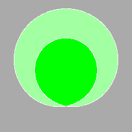

```julia
function example_winding_painter()
    math_canvas = CV_Math2DCanvas(0.0 + 1.0im, 1.0 + 0.0im, 220)

    trafo = z -> (0.7*z)^2 + 0.5 + 0.5im
    curve = cv_arc_lines(0, 2π, (0.8,))[1][1:end-1] .+ 0.1 .+ 0.1im

    bg_fill = cv_white ↦ CV_FillPainter()
    grid_style = cv_color(0.8, 0.8, 0.8) → cv_linewidth(1)
    grid = grid_style ↦ CV_GridPainter(0.0:0.1:1.0, 0.0:0.1:1.0)

    painter = CV_WindingPainter(trafo, [curve])

    cv_create_context(math_canvas) do canvas_context
        cv_paint(canvas_context, bg_fill)
        cv_paint(canvas_context, grid)
        cv_paint(canvas_context, painter)
    end

    return math_canvas
end
```

## `cv_parallel_lines`

```
cv_parallel_lines(direction;  width=1.0, lines=5, segments=120)
    direction   ComplexF64    direction for lines
    width       Real          space/width the lines cover
    lines       Integer       number of lines
    segments    Integer       how many segments per line
```

returns the `CV_LineSegments`.

## Example for `cv_parallel_lines`

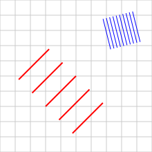

```julia
function example_parallel_lines()
    math_canvas = CV_Math2DCanvas(0.0 + 1.0im, 1.0 + 0.0im, 220)

    bg_fill = cv_white ↦ CV_FillPainter()
    grid_style = cv_color(0.8, 0.8, 0.8) → cv_linewidth(1)
    grid = grid_style ↦ CV_GridPainter(0.0:0.1:1.0, 0.0:0.1:1.0)

    trafo_red = z -> z + 0.4 + 0.4im
    red_lines = cv_parallel_lines(0.2 + 0.2im; width=0.5)
    red_style = cv_color(1, 0, 0) → cv_linewidth(2) → cv_antialias_best
    p_red = red_style ↦ CV_LinePainter(trafo_red, red_lines)

    trafo_blue = z -> z + 0.8 + 0.8im
    blue_lines = cv_parallel_lines(-0.05 + 0.2im; width=0.2, lines=10)
    blue_style = cv_color(0, 0, 1) → cv_linewidth(1) → cv_antialias_best
    p_blue = blue_style ↦ CV_LinePainter(trafo_blue, blue_lines)

    cv_create_context(math_canvas) do canvas_context
        cv_paint(canvas_context, bg_fill)
        cv_paint(canvas_context, grid)
        cv_paint(canvas_context, p_red)
        cv_paint(canvas_context, p_blue)
    end

    return math_canvas
end
```

## `cv_arc_lines`

```
cv_arc_lines(ϕ_start, ϕ_end, radii; segments=120)
    ϕ_start    Real                start angle
    ϕ_end      Real                end angle
    radii      NTuple{N, Real}     radii for the arcs
    segments   Integer             how many segments per line
```

create a `CV_LineSegments` with arcs starting at the angle `ϕ_start` and ending at the angle `ϕ_end`. In `radii` one can give radii at which the lines are created.

## Example for `cv_arc_lines`


```julia
function example_arc_lines()
    math_canvas = CV_Math2DCanvas(0.0 + 1.0im, 1.0 + 0.0im, 220)

    bg_fill = cv_white ↦ CV_FillPainter()
    grid_style = cv_color(0.8, 0.8, 0.8) → cv_linewidth(1)
    grid = grid_style ↦ CV_GridPainter(0.0:0.1:1.0, 0.0:0.1:1.0)

    trafo_red = z -> z + 0.4 + 0.4im
    red_lines = cv_arc_lines(-π/4, 3π/2, (0.1, 0.2, 0.3, 0.4))
    red_style = cv_color(1, 0, 0) → cv_linewidth(2) → cv_antialias_best
    p_red = red_style ↦ CV_LinePainter(trafo_red, red_lines)

    trafo_blue = z -> z + 0.8 + 0.8im
    blue_lines = cv_arc_lines(π, 2π, tuple(0.03:0.03:0.15...))
    blue_style = cv_color(0, 0, 1) → cv_linewidth(1) → cv_antialias_best
    p_blue = blue_style ↦ CV_LinePainter(trafo_blue, blue_lines)

    cv_create_context(math_canvas) do canvas_context
        cv_paint(canvas_context, bg_fill)
        cv_paint(canvas_context, grid)
        cv_paint(canvas_context, p_red)
        cv_paint(canvas_context, p_blue)
    end

    return math_canvas
end
```

## `cv_star_lines`

```
cv_star_lines(r_start, r_end, angles; segments=120) 
    r_start     Real                start radius
    r_end       Real                end radius
    angles      NTuple{N, Real}     lines at this angles
    segments    Integer             how many segments per line
```

create a `CV_LineSegments` with star lines starting the radius `r_start` and ending at the radius `r_end`. In `angles` one can give angles at which the lines are created.

## Example for `cv_star_lines`

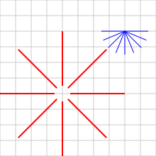

```julia
function example_star_lines()
    math_canvas = CV_Math2DCanvas(0.0 + 1.0im, 1.0 + 0.0im, 220)

    bg_fill = cv_white ↦ CV_FillPainter()
    grid_style = cv_color(0.8, 0.8, 0.8) → cv_linewidth(1)
    grid = grid_style ↦ CV_GridPainter(0.0:0.1:1.0, 0.0:0.1:1.0)

    trafo_red = z -> z + 0.4 + 0.4im
    red_lines = cv_star_lines(0.05, 0.4, tuple(0:π/4:2π...))
    red_style = cv_color(1, 0, 0) → cv_linewidth(2) → cv_antialias_best
    p_red = red_style ↦ CV_LinePainter(trafo_red, red_lines)

    trafo_blue = z -> z + 0.8 + 0.8im
    blue_lines = cv_star_lines(0, 0.15, tuple(π:π/8:2π...))
    blue_style = cv_color(0, 0, 1) → cv_linewidth(1) → cv_antialias_best
    p_blue = blue_style ↦ CV_LinePainter(trafo_blue, blue_lines)

    cv_create_context(math_canvas) do canvas_context
        cv_paint(canvas_context, bg_fill)
        cv_paint(canvas_context, grid)
        cv_paint(canvas_context, p_red)
        cv_paint(canvas_context, p_blue)
    end

    return math_canvas
end
```

## `cv_star_arc_lines`

```
cv_star_arc_lines(radii, angle; star_segments=120, arc_segments=120) 
    radii           NTuple{N, Real}
    angles          NTuple{M, Real};
    star_segments   Integer
    arc_segments    Integer
```

combination of [`cv_star_lines`](./Painter.md#user-content-cv_star_lines) and [`cv_arc_lines`](./Painter.md#user-content-cv_arc_lines).


