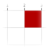
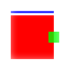
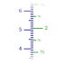

# Overview

  * [ Painter](./Painter.md)
  * [ Pixel Coordinates](./PixelCoordinates.md)
  * [ Layout (Positioning of graphic objects)](./LayoutTutorial.md)
  * [ Axes](./Axis.md)

# Index

## C

  * [`cv_create_2daxis_canvas`](./Axis.md#user-content-cv_create_2daxis_canvas)

## D

  * [`CV_DirectionPainter`](./Painter.md#user-content-cv_directionpainter)

## F

  * [`CV_FillPainter`](./Painter.md#user-content-cv_fillpainter)
  * [`cv_format_ticks`](./Axis.md#user-content-cv_format_ticks)

## G

  * [`CV_GridPainter`](./Painter.md#user-content-cv_gridpainter)

## L

  * [`CV_LinePainter`](./Painter.md#user-content-cv_linepainter)

## P

  * [`CV_PortraitPainter`](./Painter.md#user-content-cv_portraitpainter)

## R

  * [`CV_Ruler`](./Axis.md#user-content-cv_ruler)

## T

  * [`CV_TickLabel`](./Axis.md#user-content-cv_ticklabel)
  * [`CV_TickLabelAppearance`](./Axis.md#user-content-cv_ticklabelappearance)
  * [`cv_ticks_labels`](./Axis.md#user-content-cv_ticks_labels)

## V

  * [`CV_ValueMarkPainter`](./Painter.md#user-content-cv_valuemarkpainter)

## …

  * [`⇒ (U+21D2)`](./Axis.md#user-content--u21d2)

